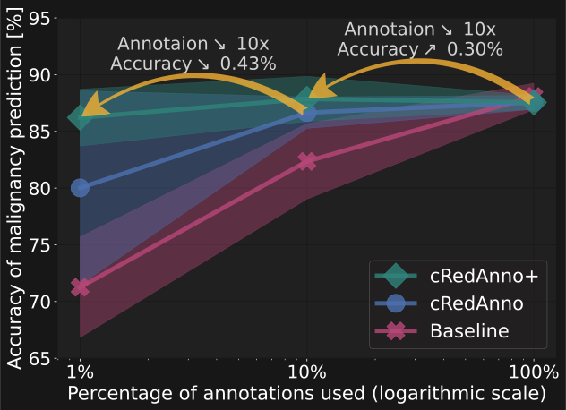

[](https://doi.org/10.1007/978-3-031-17976-1_4)

# cRedAnno 🤏

**C**onsiderably **Red**ucing **Anno**tation Need in Self-Explanatory Models

- v2 (cRedAnno+): 
[[`arXiv`](https://arxiv.org/abs/2210.16097)] 
[[`Poster`](https://ludles.github.io/assets/pdf/poster_credanno_ISBI2023.pdf)] 
[[`Slides`](https://ludles.github.io/assets/pdf/slides_credanno_ISBI2023.pdf)] 

- v1 (cRedAnno):
[[`arXiv`](https://arxiv.org/abs/2206.13608)] 
[[`Poster`](https://ludles.github.io/assets/pdf/poster_credanno.pdf)] 
[[`Slides`](https://ludles.github.io/assets/pdf/slides_credanno_MICCAI2022.pdf)] 

- [[`Dataset`](https://wiki.cancerimagingarchive.net/display/Public/LIDC-IDRI)]

------

## Method illustration

<div align="center">
    
</div>

## Performance overview

- Comparison between cRedAnno+ and cRedAnno:

<div align="center">
    
</div>

- Prediction accuracy (%) of nodule attributes and malignancy:

<table align="center" style="margin: 0px auto; text-align:center; vertical-align:middle" >
<thead>
  <tr>
    <th rowspan="2"></th>
    <th colspan="7" style="text-align:center;">Nodule attributes</th>
    <th rowspan="2">Malignancy</th>
  </tr>
  <tr>
    <th>Sub</th>
    <th>Cal</th>
    <th>Sph</th>
    <th>Mar</th>
    <th>Lob</th>
    <th>Spi</th>
    <th>Tex</th>
  </tr>
</thead>
<tbody>
  <tr>
    <td colspan="9" style="text-align:left;">Full annotation</td>
  </tr>
  <tr>
    <td style="text-align:left;">cRedAnno+</td>
    <td>96.32 ±0.61</td>
    <td>95.88 ±0.15</td>
    <td>97.23 ±0.20</td>
    <td>96.23 ±0.23</td>
    <td>93.93 ±0.87</td>
    <td>94.06 ±0.60</td>
    <td>97.01 ±0.26</td>
    <td style="text-align:center;">87.56 ±0.61</td>
  </tr>
  <tr>
    <td colspan="9" style="text-align:left;">Partial annotation</td>
  </tr>
  <tr>
    <td style="text-align:left;">cRedAnno (10%)</td>
    <td>96.06 ±2.02</td>
    <td>93.76 ±0.85</td>
    <td>95.97 ±0.69</td>
    <td>94.37 ±0.79</td>
    <td>93.06 ±0.27</td>
    <td>93.15 ±0.33</td>
    <td>95.49 ±0.85</td>
    <td style="text-align:center;">86.65 ±1.39</td>
  </tr>
  <tr>
    <td style="text-align:left;">cRedAnno+ (10%)</td>
    <td>96.23 ±0.45</td>
    <td>92.72 ±1.66</td>
    <td>95.71 ±0.47</td>
    <td>90.03 ±3.68</td>
    <td>93.89 ±1.41</td>
    <td>93.67 ±0.64</td>
    <td>92.41 ±1.05</td>
    <td style="text-align:center;">87.86 ±1.99</td>
  </tr>
  <tr>
    <td style="text-align:left;">cRedAnno (1%)</td>
    <td>93.98 ±2.09</td>
    <td>89.68 ±3.52</td>
    <td>94.02 ±2.30</td>
    <td>91.94 ±1.17</td>
    <td>91.03 ±1.72</td>
    <td>90.81 ±1.56</td>
    <td>93.63 ±0.47</td>
    <td style="text-align:center;">80.02 ±8.56</td>
  </tr>
  <tr>
    <td style="text-align:left;">cRedAnno+ (1%)</td>
    <td>95.84 ±0.34</td>
    <td>92.67 ±1.24</td>
    <td>95.97 ±0.45</td>
    <td>91.03 ±4.65</td>
    <td>93.54 ±0.87</td>
    <td>92.72 ±1.19</td>
    <td>92.67 ±1.50</td>
    <td style="text-align:center;">86.22 ±2.51</td>
  </tr>
</tbody>
</table>

------


## Usage instruction

### Dependencies

Create an environment from the [`environment.yml`](./environment.yml) file:
```bash
conda env create -f environment.yml
```
and install [`pylidc`](https://pylidc.github.io/) for dataset pre-processing.

### Data pre-processing

Use [`extract_LIDC_IDRI_nodules.py`](./extract_LIDC_IDRI_nodules.py) to extract nodule slices. 

### Training

#### 1. Unsupervised feature extraction

Following [DINO](https://github.com/facebookresearch/dino), to train on the extracted nodules:

```bash
python -m torch.distributed.launch --nproc_per_node=2 main_dino.py --arch vit_small --data_path /path_to_extracted_dir/Image/train --output_dir ./logs/vits16_pretrain_full_2d_ann --epochs 300
```

The reported results start from the ImageNet-pretrained full weights provided for [`ViT-S/16`](https://dl.fbaipublicfiles.com/dino/dino_deitsmall16_pretrain/dino_deitsmall16_pretrain_full_checkpoint.pth), which should be put under `./logs/vits16_pretrain_full_2d_ann/`.

#### 2. Semi-supervised prediction

- Sparse seeding:

    ```bash
    python eval_linear_joint_recycle.py --pretrained_weights ./logs/vits16_pretrain_full_2d_ann/checkpoint.pth --data_path /path_to_extracted_dir --output_dir ./logs/vits16_pretrain_full_2d_ann --label_frac 0.01 --lr 0.0005 --seed 42 --mode seed
    ```
- Semi-supervised active learning:

    ```bash
    python eval_linear_joint_recycle.py --pretrained_weights ./logs/vits16_pretrain_full_2d_ann/checkpoint.pth --data_path /path_to_extracted_dir --output_dir ./logs/vits16_pretrain_full_2d_ann --label_frac 0.1 --lr 0.0005 --seed 42 --mode boost
    ```

<details>
<summary>v1 (click to expand)</summary>
  
To train the predictors:

```bash
python eval_linear_joint.py --pretrained_weights ./logs/vits16_pretrain_full_2d_ann/checkpoint.pth --data_path /path_to_extracted_dir --output_dir ./logs/vits16_pretrain_full_2d_ann --label_frac 0.01
```

or use the k-NN classifiers:

```bash
python eval_knn_joint.py --pretrained_weights ./logs/vits16_pretrain_full_2d_ann/checkpoint.pth --data_path /path_to_extracted_dir --output_dir ./logs/vits16_pretrain_full_2d_ann --label_frac 0.01
```

</details>


In both cases, `--label_frac` controls the used fraction of annotations.

The results are saved in `pred_results_*.csv` files under specified `--output_dir`.


## Code reference

Our code adapts from [DINO](https://github.com/facebookresearch/dino).


