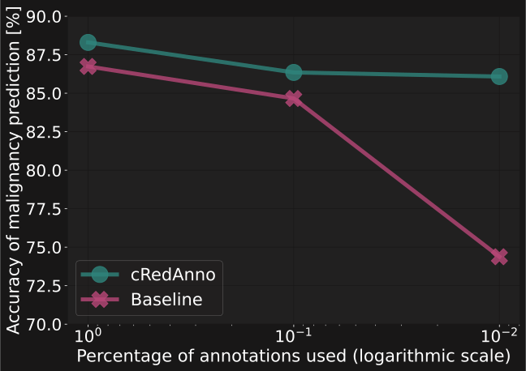

# cRedAnno 🤏: Reducing annotation need in self-explanatory models

arXiv: 

Dataset: 

### Results table & anno_reduce figure

<table align="center" style="margin: 0px auto; text-align:center; vertical-align:middle" >
<thead>
  <tr>
    <th rowspan="2"></th>
    <th colspan="7" style="text-align:center;">Nodule attributes</th>
    <th rowspan="2">Malignancy</th>
  </tr>
  <tr>
    <th>Sub</th>
    <th>Cal</th>
    <th>Sph</th>
    <th>Mar</th>
    <th>Lob</th>
    <th>Spi</th>
    <th>Tex</th>
  </tr>
</thead>
<tbody>
  <tr>
    <td colspan="9" style="text-align:left;">Full annotation</td>
  </tr>
  <tr>
    <td style="text-align:left;">cRedAnno (50-NN)</td>
    <td>94.93</td>
    <td>92.72</td>
    <td>95.58</td>
    <td>93.76</td>
    <td>91.29</td>
    <td>92.72</td>
    <td>94.67</td>
    <td style="text-align:center;">87.52</td>
  </tr>
  <tr>
    <td style="text-align:left;">cRedAnno (250-NN)</td>
    <td>96.36</td>
    <td>92.59</td>
    <td>96.23</td>
    <td>94.15</td>
    <td>90.90</td>
    <td>92.33</td>
    <td>92.72</td>
    <td style="text-align:center;">88.95</td>
  </tr>
  <tr>
    <td style="text-align:left;">cRedAnno (trained)</td>
    <td>95.84</td>
    <td>95.97</td>
    <td>97.40</td>
    <td>96.49</td>
    <td>94.15</td>
    <td>94.41</td>
    <td>97.01</td>
    <td style="text-align:center;">88.30</td>
  </tr>
  <tr>
    <td colspan="9" style="text-align:left;">Partial annotation</td>
  </tr>
  <tr>
    <td style="text-align:left;">cRedAnno (10%, 50-NN)</td>
    <td>94.93</td>
    <td>92.07</td>
    <td>96.75</td>
    <td>94.28</td>
    <td>92.59</td>
    <td>91.16</td>
    <td>94.15</td>
    <td style="text-align:center;">87.13</td>
  </tr>
  <tr>
    <td style="text-align:left;">cRedAnno (10%, 150-NN)</td>
    <td>95.32</td>
    <td>89.47</td>
    <td>97.01</td>
    <td>93.89</td>
    <td>91.81</td>
    <td>90.51</td>
    <td>92.85</td>
    <td style="text-align:center;">88.17</td>
  </tr>
  <tr>
    <td style="text-align:left;">cRedAnno (1%, trained) 🤏</td>
    <td>91.81</td>
    <td>93.37</td>
    <td>96.49</td>
    <td>90.77</td>
    <td>89.73</td>
    <td>92.33</td>
    <td>93.76</td>
    <td style="text-align:center;">86.09</td>
  </tr>
</tbody>
</table>

## Dependencies

## Usage instruction

### Data pre-processing

### Training

### Evaluation

### Pretrained model

